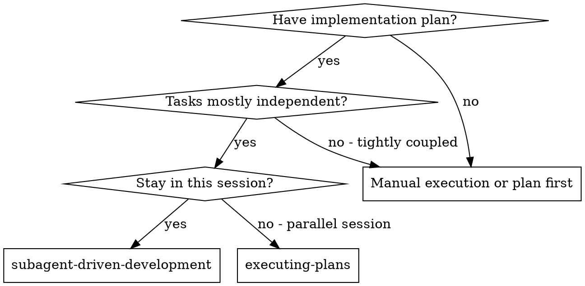
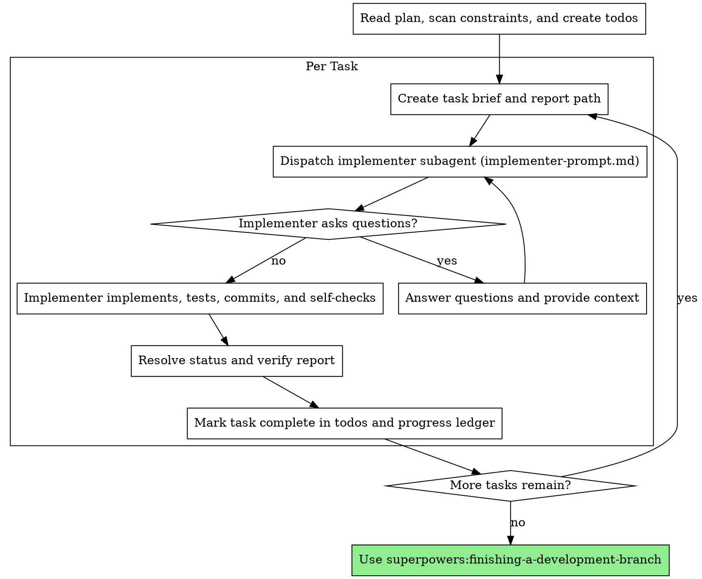

# Subagent-Driven Development

Execute a plan by dispatching a fresh implementer subagent for each task.

**Why subagents:** Each implementer receives focused context instead of the controller's full session history. This keeps tasks isolated and preserves the controller's context for coordination.

**Core principle:** Fresh subagent per task + explicit handoffs + durable progress = focused, continuous execution.

**Narration:** Between tool calls, narrate at most one short line. The ledger and tool results carry the record.

**Continuous execution:** Do not pause to check in between tasks. Execute the complete plan unless blocked by missing information, an unresolved ambiguity, or a failure that requires the human's decision.

## When to Use



**Compared with Executing Plans:**
- Same session, with no handoff
- Fresh context for each task
- Continuous execution without human checkpoints

## Process



## Pre-Flight Plan Check

Before Task 1, scan the plan once for contradictory tasks, incompatible interfaces, and conflicts with Global Constraints. Present all blocking conflicts as one batched question. If the scan is clean, proceed without comment.

## Model Selection

Use the least powerful model that can reliably complete the task.

**Mechanical tasks** such as isolated functions with complete specifications and one or two files: use a fast, inexpensive model.

**Integration tasks** involving multiple files, debugging, or pattern matching: use a standard model.

**Architecture and design tasks** requiring broad codebase judgment: use the most capable available model.

Always specify the model when dispatching. An omitted model inherits the session model and can silently defeat cost control.

Turn count matters more than token price. Use a mid-tier model as the floor for prose-heavy, multi-step tasks; use the cheapest tier when the plan provides exact code or the task is a single-file mechanical change.

## Handling Implementer Status

Implementers report one of four statuses:

**DONE:** Read the report file, confirm it includes the requested implementation and fresh test evidence, then mark the task complete.

**DONE_WITH_CONCERNS:** Read and resolve the concerns before marking the task complete. Ask the human only when the concern requires a product or plan decision.

**NEEDS_CONTEXT:** Supply the missing information and re-dispatch.

**BLOCKED:** Change the conditions before retrying:
1. Supply missing context.
2. Use a more capable model if additional reasoning is required.
3. Split the task if it is too large.
4. Escalate if the plan itself is wrong.

Never ignore an escalation or retry unchanged after a blocker.

## File Handoffs

Everything pasted into a dispatch or returned by a subagent remains in the controller's context. Pass bulk artifacts through files instead.

**Task brief:** Run `scripts/task-brief PLAN_FILE N`. It extracts the task into a unique file and prints its path. The dispatch should contain only:
- One line explaining where the task fits
- The task brief path as the source of requirements
- Interfaces and decisions from earlier tasks that the brief cannot know
- Resolutions for any ambiguity already identified
- The report-file path and report contract

**Report file:** Derive it from the brief name (`task-N-brief.md` to `task-N-report.md`). The implementer writes implementation details and test evidence there, then returns only status, commits, a one-line test summary, concerns, and the report path.

Do not paste accumulated prior-task summaries into later dispatches. A fresh implementer needs its task, affected interfaces, and binding global constraints, not the session history.

## Durable Progress

Conversation memory does not survive compaction. Track completed tasks in `.superpowers/sdd/progress.md`, not only in todos.

- At startup, use `scripts/sdd-workspace` to create the workspace and check `progress.md` if it exists.
- Do not re-dispatch tasks already marked complete.
- After verifying a DONE report, append `Task N: complete (commits <base7>..<head7>, tests <summary>)`.
- After compaction, trust the ledger and `git log` over recollection.
- If cleanup removes the workspace, recover progress from `git log`.

## Prompt Template

Use [implementer-prompt.md](implementer-prompt.md) for each implementer dispatch.

## Example

```text
Controller: I'm using Subagent-Driven Development to execute this plan.

[Read plan, create todos, and check progress ledger]
[Run scripts/task-brief for Task 1]
[Dispatch implementer with brief and report paths]

Implementer: "Should the hook be installed at user or system level?"
Controller: "User level."

Implementer:
  Status: DONE
  Commits: abc1234 Add hook installation
  Tests: 5/5 passing, output pristine
  Report: .superpowers/sdd/task-1-report.md

[Read report, verify evidence, mark task complete, update ledger]
[Continue directly to Task 2]
```

## Advantages

- Fresh context per task
- Complete requirements through task briefs
- Small controller context through file handoffs
- Questions surface before or during implementation
- Durable recovery after compaction
- Test evidence and self-checks remain attached to each task

## Red Flags

**Never:**
- Start implementation on `main` or `master` without explicit consent
- Dispatch multiple implementers in parallel when they share a workspace
- Make an implementer read the entire plan instead of its task brief
- Omit scene-setting context or affected interfaces
- Ignore questions, concerns, or blockers
- Mark DONE without reading the report and checking test evidence
- Re-dispatch a task already marked complete in the progress ledger
- Paste the whole session history into a fresh dispatch

**If an implementer fails:**
- Re-dispatch with specific changes to context, model, or task scope
- Do not take over implementation manually unless delegation is no longer viable

## Integration

**Required workflow skills:**
- **superpowers:writing-plans** - Creates the plan this skill executes
- **superpowers:finishing-a-development-branch** - Completes development after all tasks

**Implementers should use:**
- **superpowers:test-driven-development** - Applies TDD to each task

**Alternative workflow:**
- **superpowers:executing-plans** - Use for execution in a separate session
